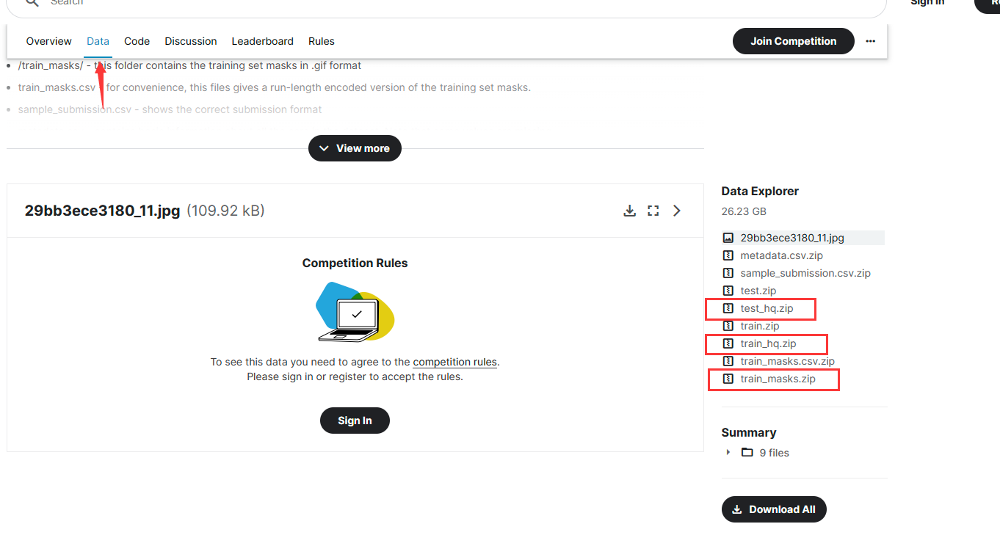

# UNet

UNet是在医学影像领域经久不衰的网络结构，代码来自GitHub，地址为：https://github.com/milesial/Pytorch-UNet  

我们对该项目做了一些改进，主要是增加了num of workers参数  

## Windows下运行
如果你想要在windows下运行这份代码，请阅读scripts文件夹中的sh脚本，并按照里面的内容操作，或：
1. 在kaggle平台注册账号
2. 访问https://www.kaggle.com/c/carvana-image-masking-challenge
3. 在如下图所示的位置下载三个压缩包：  
   
4. 其中train_hq.zip解压后，把所有图片放在Pytorch-UNet\data\imgs下，如果没有该文件路径就新建一个。train_masks.zip解压后，把所有图片放在Pytorch-UNet\data\masks下。
5. 随后就可以按照其中readme的提示开始训练了。要注意我们的版本不仅需要手动输入batch size，还要输入number of works。具体方法需要阅读代码。

## 注意
由于采用了wandb模块，所以该代码运行时必须要能够访问外网

## TODO
1. 去掉wandb的依赖，使网络在国内网络环境也能运行